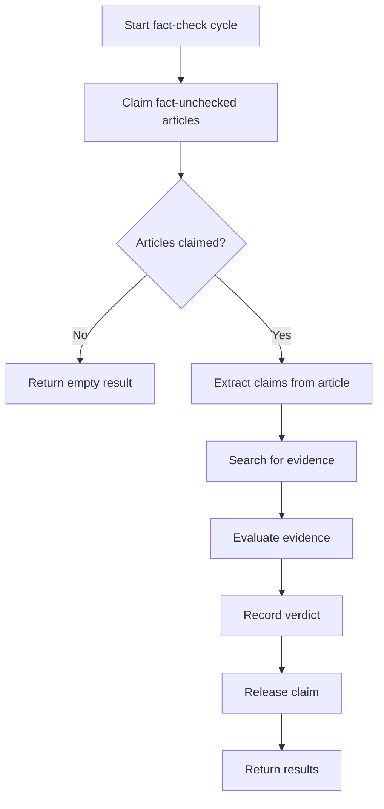

# Fact-Check Business Logic

## Workflow

## Skills

- `fc-extract-claims` — Extract key claims from the article
- `fc-search-evidence` — Search for supporting or refuting evidence
- `fc-record-verdict` — Record the fact-check verdict in the database
