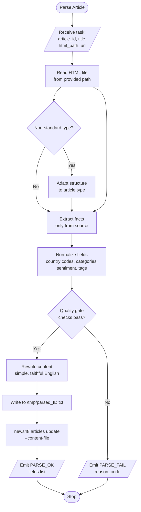

# Parser Agent Business Logic

## Always Active Skills

| Skill | Purpose |
|-------|---------|
| `read-source` | Always read HTML before extracting |
| `extract-facts` | Only explicit source evidence, no invented dates/entities |
| `normalize-fields` | ISO-2 countries, controlled categories, 8-140 char titles |
| `rewrite-content` | 2-4 paragraphs, plain language, no boilerplate |
| `enforce-quality` | Quality gate before update, fidelity checks |
| `stage-file` | Write to /tmp, use --content-file |
| `verify-result` | Emit PARSE_OK or PARSE_FAIL, caller detects via parsed_at |

## Conditional Skills

| Skill | Condition |
|-------|-----------|
| `adapt-to-type` | non_standard_type - Non-standard article types |
| `report-failure` | quality_gate_failure - Quality gate failure |

## Notes

- The parser itself emits `PARSE_OK` or `PARSE_FAIL`; the caller verifies the
  persisted result after the agent run.
- Failure reporting is an intra-run branch triggered after source reading or
  quality evaluation, not something that must be known at prompt composition.
