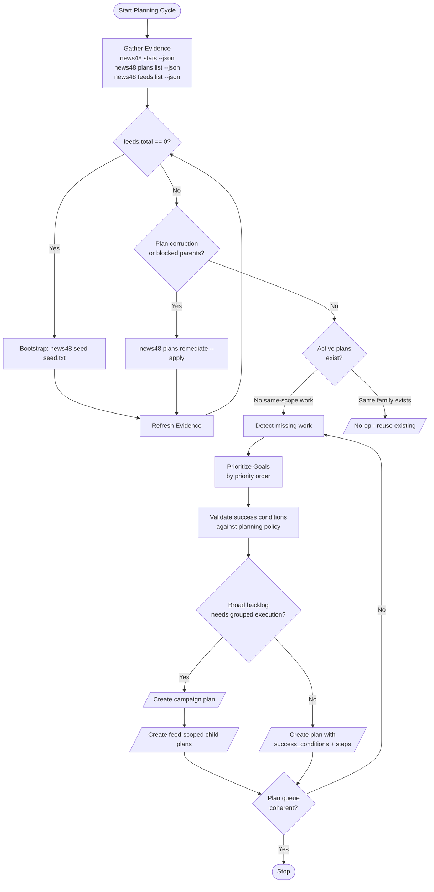

# Planner Agent Business Logic

## Always Active Skills

| Skill | Purpose |
|-------|---------|
| `begin-planning-cycle` | Evidence gathering and bootstrap |
| `prioritize-goals` | Priority order: feed freshness → article completeness → parsing → failure recovery → fact-check → stuck plans → retention → feed health → DB health |
| `write-conditions` | Success conditions before steps, outcome not activity |
| `build-plan` | Minimal steps, verification step, no CLI commands in descriptions |
| `deduplicate-plans` | One plan per concern, check existing plans first |

## Conditional Skills

| Skill | Condition |
|-------|-----------|
| `throughput-emergency` | `backlog_high` - backlog pressure requires throughput-first planning |
| `plan-fact-check` | `fact_check_backlog` - eligible fact-check backlog exists |
| `plan-retry` | `failed_backlog` - download or parse failures exist |
| `remediate-stuck` | `stale_plans` - stale or requeued plans remain after recovery |

## Notes

- Planner branch skills are preloaded because the decision to use them is made
  after evidence gathering inside the same cycle.
- `news48 plans remediate --apply --json` is a queue-repair action, not normal
  plan creation. Use it before deciding a new remediation plan is needed.
- Campaign plans are grouping records; feed/domain child plans are the units the
  executor should actually claim.
- Retention is not optional: if cleanup evidence shows expired articles, the
  planner should create cleanup work that drives the database back to zero
  articles older than 48 hours.
