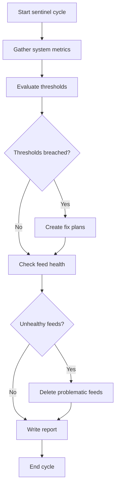

# Sentinel Business Logic

## Workflow

## Steps

1. **Gather metrics** — Run `news48 stats --json`, `news48 feeds list --json`, `news48 plans list --json`, and `news48 cleanup health --json`.
2. **Check for empty database** — If total feeds is 0, the database needs seeding. Create a plan for the executor with one step: `news48 seed seed.txt --json`. The file `seed.txt` contains feed URLs and lives in the project root. Skip all other steps (no thresholds to evaluate on an empty system).
3. **Evaluate thresholds** — Compare metrics against the thresholds skill. Classify as HEALTHY, WARNING, or CRITICAL. Note: download and parse backlogs are self-healing (automated by the orchestrator) and must not trigger plan creation.
4. **Create fix plans** — If WARNING or CRITICAL for non-automated metrics, use `create_plan` with concrete CLI steps. Check `news48 plans list --json` first to avoid duplicating existing pending plans. **Never create plans for bulk downloads, bulk fetches, or bulk parsing** — these are automated.
5. **Check feed health** — Apply feed-curation rules to detect and delete problematic feeds.
6. **Write report** — Call `write_sentinel_report` with status, metrics, alerts, and recommendations. This writes to `.monitor/latest-report.json`.
7. **Save lessons** — Record any new insight using `save_lesson`.
