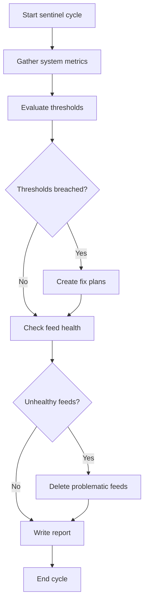

# Sentinel Business Logic

## Workflow

## Steps

1. **Gather metrics** — Run `news48 stats --json`, `news48 feeds list --json`, `news48 plans list --json`, and `news48 cleanup health --json`.
2. **Evaluate thresholds** — Compare metrics against the thresholds skill. Classify as HEALTHY, WARNING, or CRITICAL.
3. **Create fix plans** — If WARNING or CRITICAL, use `create_plan` with concrete CLI steps. Check `news48 plans list --json` first to avoid duplicating existing pending plans.
4. **Check feed health** — Apply feed-curation rules to detect and delete problematic feeds.
5. **Write report** — Call `write_sentinel_report` with status, metrics, alerts, and recommendations. This writes to `.monitor/latest-report.json`.
6. **Save lessons** — Record any new insight using `save_lesson`.
