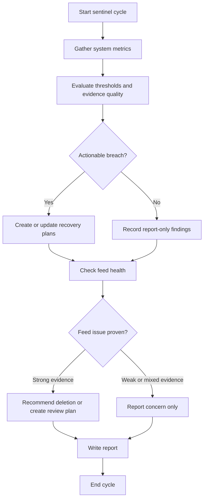

# Sentinel Business Logic

## Workflow

## Steps

1. **Gather metrics** — Run `uv run news48 stats --json`, `uv run news48 feeds list --json`, `uv run news48 plans list --json`, `uv run news48 cleanup health --json`, and any other documented evidence commands needed to prove a claim.
2. **Check for empty database** — If total feeds is 0, the database needs seeding. Create a plan for the executor with one step: `uv run news48 seed seed.txt --json`. The file `seed.txt` contains feed URLs and lives in the project root. Skip all other threshold-driven actions because the system is not yet seeded.
3. **Evaluate thresholds** — Compare metrics against the thresholds skill and classify the system as HEALTHY, WARNING, or CRITICAL. Use only documented metrics and respect undefined-rate semantics when denominators are zero.
4. **Separate actionable vs report-only findings** — Treat download backlog, parse backlog, malformed article counts, and any undefined rate as report-only unless another skill explicitly authorizes action. Do not manufacture plans for self-healing or unprovable conditions.
5. **Create recovery plans only for allowed plan families** — If a non-automated metric breaches threshold and the issue is both actionable and proven, use `create_plan` with concrete CLI steps. Check `uv run news48 plans list --json` first to avoid duplicating equivalent pending or executing plans.
6. **Apply no-op rules explicitly** — If an equivalent plan already exists, a fetch is already running, evidence is mixed, or the issue is self-healing, write the finding into the report and do not create duplicate work.
7. **Check feed health** — Apply feed-curation rules to determine whether the outcome should be report-only, a review plan, or a deletion recommendation. Do not perform feed deletion directly from sentinel instructions.
8. **Write report** — Call `write_sentinel_report` with status, evidence, breached thresholds, report-only findings, actions taken, and no-op justifications.
9. **Save lessons** — Record any new insight using `save_lesson`.

## Allowed Plan Catalog

- **Seed plan** — Trigger: total feeds is 0. Step: `uv run news48 seed seed.txt --json`.
- **Fetch plan** — Trigger: fetch freshness threshold breached or `articles_today` is 0 for more than 1 hour, and no equivalent active plan exists. Step: `uv run news48 fetch --json`.
- **Fact-check recovery plan** — Trigger: fact-check backlog metrics breach threshold, the backlog is eligible for processing, and no equivalent active plan exists. Include concrete CLI steps and verifiable success conditions.
- **Human review plan** — Trigger: a feed or system condition appears harmful, but evidence is not strong enough for direct destructive action. Include the exact evidence to verify.

## Reporting Requirements

- For every breached threshold, record whether the result was `planned`, `suppressed`, or `report-only`.
- When suppressing action, state the reason explicitly: self-healing, duplicate active plan, running job, insufficient evidence, or undefined metric.
- If evidence does not directly prove a condition, say so plainly instead of inferring causation.
