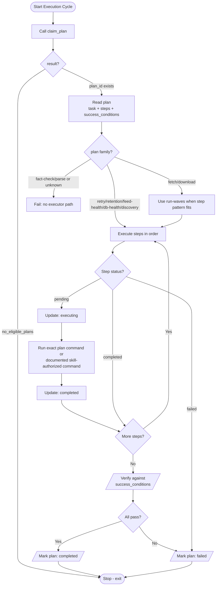

# Executor Agent Business Logic

## Always Active Skills

| Skill | Purpose |
|-------|---------|
| `claim-plan` | Call once, exit if no plans |
| `manage-steps` | Use exact step IDs, never rollback failed steps |
| `run-command` | timeout as tool param, use `news48 ... --json` when supported |
| `verify-plan` | PASS/FAIL/INVALID per condition, all must pass for completed |

## Conditional Skills (by plan_family)

| Skill | Condition |
|-------|-----------|
| `run-waves` | `plan_family:fetch` or `plan_family:download` |
| `add-steps` | plan_family:discovery |
| `run-cleanup` | plan_family:retention (includes summary cleanup) |
| `run-feed-health` | plan_family:feed-health |
| `run-db-health` | plan_family:db-health |
| `run-retry` | plan_family:retry |

## Out-of-Scope Plan Families

The following plan families have **no executor path** and must be failed immediately upon claiming:

| Family | Reason | Error code |
|--------|--------|------------|
| `fact-check` | Handled autonomously by the scheduled `fact_checker` agent (10-min interval, up to 3 concurrent). Executor fact-check attempts exceed the 10-minute runtime limit and cause timeout→requeue loops. | `sys.plan` |
| `parse` | Handled autonomously by the scheduled `parser` agent (5-min interval). Parser claims articles directly from the database, not via plans. | `sys.plan` |

When failing an out-of-scope plan, use result: `"Plan family '<family>' has no executor path — handled by dedicated <agent_name> agent."`

## Notes

- The executor follows one claimed plan only and must always end with a
  terminal plan status.
- If a plan step cannot be mapped to an exact documented command or skill-defined
  action, the step is invalid and should fail explicitly.
