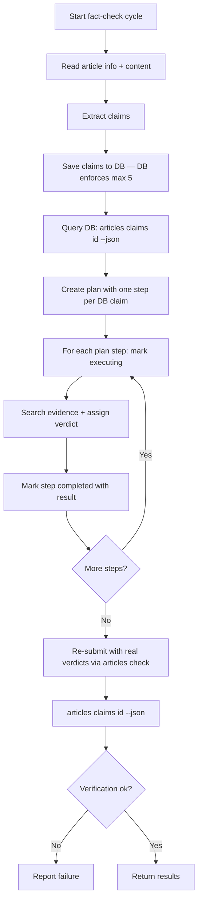

# Fact-Check Business Logic

## Workflow

## Skills

- **fc-extract-claims** — Extract claims, save to DB, query back.
- **fc-follow-plan** — Create a plan with one step per claim, execute step by step.
- **fc-search-evidence** — Search the web for
  supporting or refuting evidence and assign a per-claim verdict.
- **fc-record-verdict** — Re-submit claims with real verdicts via
  `articles check --claims-json-file` and verify with `articles claims`.
- **cli-reference-fact-checker** —
  Authoritative reference for `articles check` and `articles claims`.

## Persistence model

The article-level `fact_check_status` and `fact_check_result` are stored on
`articles`. The individual claims are stored one-row-per-claim in the
`claims` table (`article_id`, `claim_text`, `verdict`, `evidence_summary`,
`sources`, `created_at`). The overall article verdict is **derived** from
the per-claim verdicts by the CLI — the agent never submits it directly in
the normal flow.

## Invariants

- Exactly one article per run (the one in the task input).
- Submitting a new `--claims-json-file` **replaces** all previous claims for that
  article (idempotent re-check).
- A `verified` per-claim verdict requires ≥ 2 independent reputable sources
  in its `sources` array.
- An empty `sources` array is only valid for an `unverifiable` verdict.
