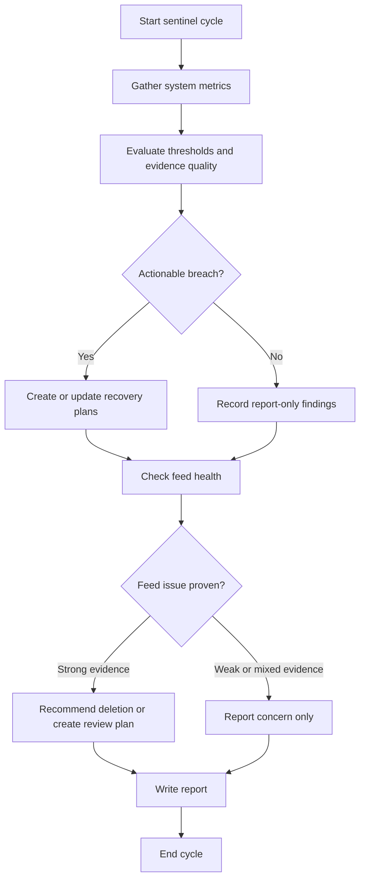

# Sentinel Business Logic

## Workflow

## Steps

1. **Check service connectivity** — Run `news48 doctor --json` first to verify all external services (database, Redis, Byparr, SearXNG, LLM API) are reachable and all required environment variables are configured. If any service reports `error` status, include the error details and fix suggestion in your report. If the database is unreachable, skip remaining steps and report CRITICAL. If Redis is unreachable, report CRITICAL (agents cannot run). If Byparr, SearXNG, or LLM API are unreachable, report WARNING (pipeline stages will fail but the system is not down).
2. **Gather metrics** — Run `news48 stats --json`, `news48 feeds list --json`, `news48 plans list --json`, `news48 cleanup health --json`, `news48 fact-check status --json`, and any other documented evidence commands needed to prove a claim. The `fact-check status` command provides a focused view of the fact-check pipeline: article counts by verdict, active processing, and plan breakdown — use it to assess fact-check backlog and detect stuck processing.
3. **Check for empty database** — If total feeds is 0, the database needs seeding. Create a plan for the executor with one step: `news48 seed /app/seed.txt --json`. The file `seed.txt` contains feed URLs and lives in the project root. Skip all other threshold-driven actions because the system is not yet seeded.
4. **Evaluate thresholds** — Compare metrics against the thresholds skill and classify the system as HEALTHY, WARNING, or CRITICAL. Use only documented metrics and respect undefined-rate semantics when denominators are zero.
5. **Separate actionable vs report-only findings** — Treat download backlog, parse backlog, fact-check backlog, malformed article counts, and any undefined rate as report-only unless another skill explicitly authorizes action. Do not manufacture plans for self-healing or unprovable conditions.
6. **Create recovery plans only for allowed plan families** — If a non-automated metric breaches threshold and the issue is both actionable and proven, use `create_plan` with concrete CLI steps. Check `news48 plans list --json` first to avoid duplicating equivalent pending or executing plans.
7. **Apply no-op rules explicitly** — If an equivalent plan already exists, a fetch is already running, evidence is mixed, or the issue is self-healing, write the finding into the report and do not create duplicate work.
8. **Check feed health** — Apply feed-curation rules to determine whether the outcome should be report-only, a review plan, or a deletion recommendation. Do not perform feed deletion directly from sentinel instructions.
9. **Write report** — Call `write_sentinel_report` with status, evidence, breached thresholds, report-only findings, actions taken, and no-op justifications.
10. **Save lessons** — Record any new insight using `save_lesson`.

## Allowed Plan Catalog

- **Seed plan** — Trigger: total feeds is 0. Step: `news48 seed seed.txt --json`.
- **Fetch plan** — Trigger: fetch freshness threshold breached or `articles_today` is 0 for more than 1 hour, and no equivalent active plan exists. Step: `news48 fetch --json`.
- **Human review plan** — Trigger: a feed or system condition appears harmful, but evidence is not strong enough for direct destructive action. Include the exact evidence to verify.

- **Patch missing fields plan** — Trigger: `missing_fields` count ≥ 5 (WARNING) or ≥ 20 (CRITICAL) and no equivalent active plan exists. Step: `news48 articles patch-missing --limit 20 --json`. This fixes parsed articles that are missing summary, categories, sentiment, or tags without re-parsing.

## Reporting Requirements

- For every breached threshold, record whether the result was `planned`, `suppressed`, or `report-only`.
- When suppressing action, state the reason explicitly: self-healing, duplicate active plan, running job, insufficient evidence, or undefined metric.
- If evidence does not directly prove a condition, say so plainly instead of inferring causation.
