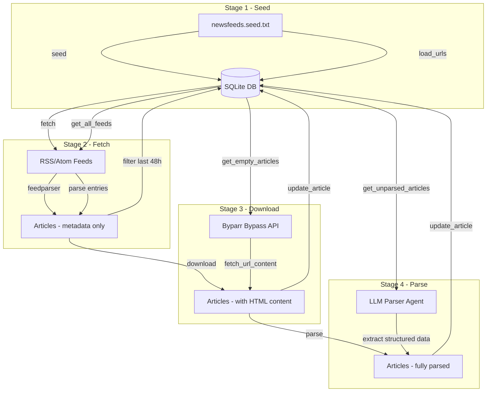
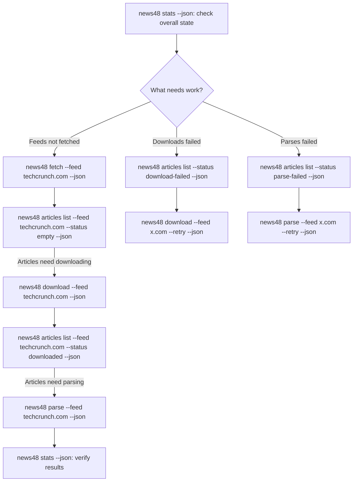
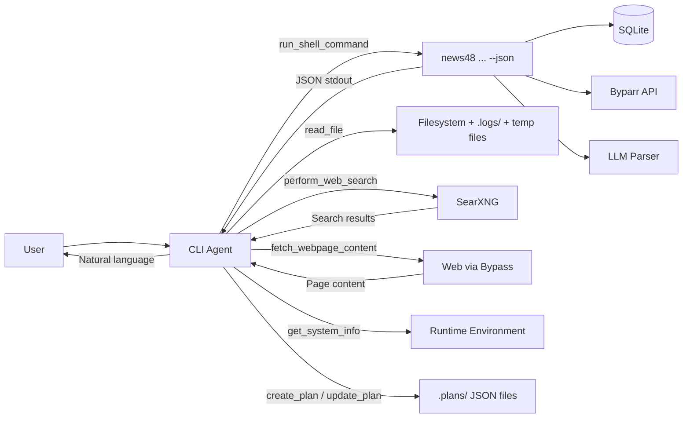

# CLI Agent Plan: Revised Approach

## Core Insight

The CLI **is** the tool interface. The agent does not need new pipeline tools — it needs to learn how to use the existing CLI via `run_shell_command`. The agent is a **worker** in the news48 system with distinct roles and the ability to plan, search, verify, and execute autonomously.

The work is:

1. Enhance CLI commands: add `--feed` domain filter, `--json` flag, `--retry` for downloads, and new `articles` command group
2. Keep default output clean and simple with real-time feedback; `--json` flag for machine-readable output
3. Add persistent planning so the agent can track multi-step workflows
4. Equip the agent with search + fetch capabilities for fact-checking and verification
5. Write a CLI reference document and agent instructions organized by role

---

## 1. System Workflow



### CLI Commands

All commands use the `news48` entrypoint (defined in [`pyproject.toml:21`](pyproject.toml:21) via `uv`).

| Command | Stage | What it does |
|---------|-------|-------------|
| `news48 seed <file> [--json]` | 1 | Load feed URLs from file into DB |
| `news48 fetch [--feed domain] [--delay 0.5] [--json]` | 2 | Fetch RSS/Atom feeds, store article metadata |
| `news48 download [--feed domain] [--limit 10] [--delay 1.0] [--retry] [--json]` | 3 | Download HTML content for articles |
| `news48 parse [--feed domain] [--limit 10] [--delay 1.0] [--retry] [--json]` | 4 | Parse articles with LLM agent |
| `news48 stats [--stale-days 7] [--json]` | — | Show system statistics |
| `news48 feeds list [--limit 20] [--offset 0] [--json]` | — | List feeds |
| `news48 feeds add <url> [--json]` | — | Add a feed |
| `news48 feeds delete <id-or-url> [--force] [--json]` | — | Delete a feed |
| `news48 feeds info <id-or-url> [--json]` | — | Show feed details |
| `news48 articles list [--feed domain] [--status X] [--limit 20] [--offset 0] [--json]` | — | **NEW**: List articles with filters |
| `news48 articles info <id-or-url> [--json]` | — | **NEW**: Show article metadata (no content — articles can be 80k tokens) |

The `--feed` flag accepts a **domain name** (e.g., `techcrunch.com`, `arstechnica.com`) and restricts the command to operate only on feeds/articles matching that domain. The resolver matches the domain against the feed URL column using a `LIKE` pattern. If multiple feeds match the same domain, all are included.

The `--json` flag switches output from clean text to structured JSON. The agent always passes `--json`; humans get readable output with real-time feedback by default.

### What's new vs. current

| Change | Why |
|--------|-----|
| `--feed domain` on `fetch`, `download`, `parse` | Agent needs surgical control per feed — never run the full pipeline at once |
| `--retry` on `download` | Currently missing! Failed downloads are stuck permanently ([`get_empty_articles()`](database.py:559) filters `download_failed = 0`) |
| `--json` on all commands | Agent needs machine-readable output |
| `articles list` + `articles info` | Agent cannot see articles at all right now — critical gap for monitoring and troubleshooting |

### What's NOT changed

No commands removed. All existing commands serve a purpose.

### Agent workflow — stage by stage, never full pipeline at once



The agent **always runs one stage at a time**, inspects the results, and decides what to do next. Never "run the full pipeline."

---

## 2. Agent Roles

The CLI agent is a **worker** in the news48 system. Feeds are curated in [`newsfeeds.seed.txt`](newsfeeds.seed.txt) — the agent does not discover or curate feeds. It operates in these roles:

### Role: Pipeline Operator

Runs individual pipeline stages, targeting specific feeds. Checks stats and article status between stages. **Never runs the full pipeline at once** — it runs each stage independently, inspects results, and decides what comes next.

**Tools used**: `run_shell_command`, planning tools

**Example tasks**:
- "Fetch techcrunch.com and check how many articles need downloading"
- "Download articles for arstechnica.com"
- "Parse the downloaded articles for bbc.com"
- "Retry all failed downloads"

### Role: System Monitor

Checks pipeline stats, monitors system health, inspects articles and feeds. Uses `articles list` with status filters to understand the state of the database.

**Tools used**: `run_shell_command`, `read_file`, `get_system_info`

**Example tasks**:
- "How many articles were parsed today?"
- "Which feeds have download failures?"
- "Show me all unparsed articles for reuters.com"
- "Give me a full system health report"

### Role: Troubleshooter

Investigates failures in the pipeline — download errors, parse failures, stale feeds. Inspects specific articles. Retries operations per-feed. Fetches failing URLs directly to diagnose issues.

**Tools used**: `run_shell_command`, `read_file`, `perform_web_search`, `fetch_webpage_content`

**Example tasks**:
- "Why is feed X failing to download?"
- "Inspect article 42 — what went wrong?"
- "This feed URL changed, find the new one and update it"
- "Retry all failed parses for nytimes.com"

### Role: Fact Checker

When the agent needs to verify or cross-reference information from the pipeline, it can search the web and fetch content. This is for **double-checking information**, not feed discovery.

**Tools used**: `perform_web_search`, `fetch_webpage_content`, `read_file`

**Example tasks**:
- "Is this article's claim about X verified by other sources?"
- "Cross-reference this news story with other reports"
- "Check if this feed URL is still valid — fetch it directly"

---

## 3. CLI Output Design

### Dual mode: text default, JSON with `--json`

Default output is **clean, simple text** with real-time progress feedback. When `--json` is passed, output is **only** structured JSON, well-formatted, no progress noise.

**Pattern for every command:**

```python
import json
import sys

async def _seed(seed_file: str) -> dict:
    """Returns data dict. May print progress to stderr."""
    db_path = require_db()
    init_database(db_path)
    urls = load_urls(seed_file)
    print(f"Seeding {len(urls)} feed URLs...", file=sys.stderr)
    count = seed_feeds(db_path, urls)
    return {"seeded": count, "total_urls": len(urls), "skipped": len(urls) - count}

def seed(
    seed_file: str = typer.Argument(..., help="Path to the seed file"),
    output_json: bool = typer.Option(False, "--json", help="Output as JSON"),
) -> None:
    data = asyncio.run(_seed(seed_file))
    if output_json:
        json.dump(data, sys.stdout, default=str, indent=2)
    else:
        print(f"Seeded {data['seeded']} new feeds ({data['skipped']} skipped, {data['total_urls']} total)")
```

Progress/status messages go to **stderr** so they don't pollute JSON on stdout.

### JSON schemas for each command

| Command | JSON Output Schema |
|---------|-------------------|
| `seed` | `{seeded: int, total_urls: int, skipped: int}` |
| `fetch` | `{feed_filter: str or null, feeds_fetched: int, entries: int, valid: int, success_rate: float, successful: [...], failed: [...]}` |
| `download` | `{feed_filter: str or null, downloaded: int, failed: int, total: int, retry: bool}` |
| `parse` | `{feed_filter: str or null, parsed: int, failed: int, total: int, retry: bool, results: [{title, url, success}]}` |
| `stats` | `{db_size_mb: float, articles: {total, parsed, ...}, feeds: {total, stale, ...}, ...}` |
| `feeds list` | `{total: int, limit: int, offset: int, feeds: [{id, title, url, last_fetched_at}]}` |
| `feeds add` | `{added: bool, id: int, url: str}` or `{added: false, reason: str}` |
| `feeds delete` | `{deleted: bool, url: str, articles_removed: int}` |
| `feeds info` | `{id, url, title, description, last_fetched_at, created_at, updated_at, article_count}` |
| `articles list` | `{feed_filter: str or null, status_filter: str or null, total: int, limit: int, offset: int, articles: [{id, title, url, feed_url, status, created_at}]}` |
| `articles info` | `{id, title, url, feed_url, content_length: int, status, published_at, parsed_at, sentiment, categories, tags, countries, errors: {download_error, parse_error}}` |

**Important**: `articles info` returns `content_length` (not content itself). Article content can be 80k+ tokens. The parse command already writes content to temp files at [`commands/parse.py:34`](commands/parse.py:34) — the agent can `read_file` on temp files if it needs to inspect raw content.

### Article statuses

Derived from the database columns — the `articles list --status` filter uses these:

| Status | Meaning | SQL condition |
|--------|---------|---------------|
| `empty` | Needs downloading | `content IS NULL AND download_failed = 0` |
| `downloaded` | Has content, needs parsing | `content IS NOT NULL AND parsed_at IS NULL AND parse_failed = 0` |
| `parsed` | Fully processed | `parsed_at IS NOT NULL` |
| `download-failed` | Download attempt failed | `download_failed = 1` |
| `parse-failed` | Parse attempt failed | `parse_failed = 1` |

### Files to modify for output simplification

- [`commands/_common.py`](commands/_common.py) — replace Rich `Console` with simple text + JSON helpers
- [`commands/seed.py`](commands/seed.py) — replace Rich spinner with stderr progress
- [`commands/fetch.py`](commands/fetch.py) — replace Rich table + progress bar with simple text
- [`commands/download.py`](commands/download.py) — replace Rich progress bar with simple text
- [`commands/parse.py`](commands/parse.py) — replace Rich output with simple text
- [`commands/stats.py`](commands/stats.py) — already has `--json` at [`commands/stats.py:276`](commands/stats.py:276); simplify text output
- [`commands/feeds.py`](commands/feeds.py) — replace Rich tables with simple text

### Interactive prompts

[`commands/feeds.py:149`](commands/feeds.py:149) uses `typer.confirm()` for delete confirmation. The agent cannot answer interactive prompts. Solution: the agent must always pass `--force` flag when deleting. Document this in the CLI reference.

---

## 4. Tool Analysis for CLI Agent

### The agent needs 7 tools + planning

| Tool | Purpose | Used by Roles |
|------|---------|---------------|
| `run_shell_command` | Execute `news48` CLI commands | Pipeline Operator, System Monitor, Troubleshooter |
| `read_file` | Read seed files, config, logs, temp files with article content | System Monitor, Troubleshooter, Fact Checker |
| `perform_web_search` | Search the web to verify information, check feed URLs | Troubleshooter, Fact Checker |
| `fetch_webpage_content` | Fetch webpage content with anti-bot bypass for verification | Troubleshooter, Fact Checker |
| `get_system_info` | Get runtime environment info — quick and convenient | System Monitor |
| `create_plan` | Create a persistent execution plan | All roles |
| `update_plan` | Update step status in a persistent plan | All roles |

### Why search tools are essential

The agent is not just a pipeline controller — it must also be able to **double-check information** when needed. Key scenarios:

- **Feed validation**: Check if a feed URL is still valid by fetching it directly
- **Troubleshooting**: Investigate why a specific URL fails to download — fetch it directly and inspect
- **Fact checking**: Verify claims in parsed articles against other sources
- **URL recovery**: When a feed URL changes, search for the new one
- **General verification**: Cross-reference pipeline data with live web information

The `perform_web_search` → `fetch_webpage_content` workflow is already well-established in the existing operator agent instructions.

### Tools to remove

| Tool | Reason |
|------|--------|
| `list_directory` | Not needed — use `run_shell_command` with `ls` |
| `get_file_info` | Merged into `read_file` |
| `read_file_chunk` | Merged into `read_file` |
| `get_file_content` | Merged into `read_file` |

### Planning tools: mandatory, redesigned

The current planner at [`agents/tools/planner.py`](agents/tools/planner.py) has 7 tools and stores plans in-memory at [`agents/tools/planner.py:59`](agents/tools/planner.py:59):

```python
_plans: dict[str, Plan] = {}
```

This means plans are lost when the agent process exits. For a worker agent that may be run repeatedly or on a schedule, plans need **persistence**.

#### Redesigned planning: 2 tools, file-based persistence

Replace the 7 in-memory planner tools with 2 persistent tools:

| Tool | Purpose |
|------|---------|
| `create_plan` | Create a new execution plan, write to JSON file |
| `update_plan` | Update step statuses, results, or add/remove steps in an existing plan |

**Persistence**: Plans stored as JSON files in `.plans/` directory:
- `.plans/{plan_id}.json` — one file per plan
- Agent can `read_file` any plan to check status
- Plans survive process restarts
- Simple to inspect and debug

**Plan file schema:**
```json
{
    "id": "uuid",
    "task": "Fetch and download articles for techcrunch.com",
    "status": "in_progress",
    "created_at": "2026-04-03T09:00:00Z",
    "updated_at": "2026-04-03T09:05:00Z",
    "steps": [
        {
            "id": "step-1",
            "description": "Check system stats",
            "status": "completed",
            "result": "15 feeds, 120 articles, 45 unparsed",
            "created_at": "...",
            "updated_at": "..."
        },
        {
            "id": "step-2",
            "description": "Fetch techcrunch.com feeds",
            "status": "in_progress",
            "result": null,
            "created_at": "...",
            "updated_at": "..."
        }
    ]
}
```

**`create_plan` signature:**
```python
def create_plan(reason: str, task: str, steps: list[str]) -> str:
    """Create plan, write to .plans/{id}.json, return plan JSON."""
```

**`update_plan` signature:**
```python
def update_plan(
    reason: str,
    plan_id: str,
    step_id: str,
    status: str,  # pending | in_progress | completed | failed
    result: str = "",
    add_steps: list[str] | None = None,
    remove_steps: list[str] | None = None,
) -> str:
    """Update a step status and optionally add/remove steps. Returns updated plan JSON."""
```

This collapses 7 tools down to 2, while adding persistence.

### Process spawning and tracking

The agent can run parallel operations by backgrounding shell commands:

```bash
# Spawn background fetch for techcrunch.com, log to file
news48 fetch --feed techcrunch.com --json > .logs/fetch-techcrunch.log 2>&1 & echo $!

# Spawn background download for arstechnica.com
news48 download --feed arstechnica.com --json > .logs/download-ars.log 2>&1 & echo $!

# Check if process is still running
ps -p 12345 -o pid,state,etime --no-headers 2>&1

# Read output when done
cat .logs/fetch-techcrunch.log
```

This is handled via instructions — the agent learns to use `run_shell_command` with `&` for backgrounding, then `read_file` or `cat` to check results. A `.logs/` directory is used for output files.

### Final tool count: 7 tools (down from 15)

---

## 5. Implementation Steps

### Step 1: Add `--feed` domain filter to pipeline commands

Add an optional `--feed <domain>` parameter to `fetch`, `download`, and `parse`.

**Database layer** — add optional `feed_domain` parameter to:
- [`get_all_feeds()`](database.py:142) — add `WHERE url LIKE '%{domain}%'` when provided
- [`get_empty_articles()`](database.py:559) — add `AND f.url LIKE '%{domain}%'` when provided
- [`get_unparsed_articles()`](database.py:505) — add `AND f.url LIKE '%{domain}%'` when provided
- [`get_parse_failed_articles()`](database.py:533) — add `AND f.url LIKE '%{domain}%'` when provided

**CLI layer** — add `--feed` option to:
- [`commands/fetch.py`](commands/fetch.py) — filter feeds list by domain
- [`commands/download.py`](commands/download.py) — pass domain filter to `get_empty_articles()`
- [`commands/parse.py`](commands/parse.py) — pass domain filter to `get_unparsed_articles()`

**Shared resolver** — add to [`commands/_common.py`](commands/_common.py):
```python
def resolve_feed_ids(db_path: Path, domain: str) -> list[int]:
    """Find all feed IDs matching a domain. Returns empty list if none match."""
```

### Step 2: Add `--retry` to download command

Add `--retry` flag to [`commands/download.py`](commands/download.py), mirroring [`commands/parse.py:194`](commands/parse.py:194).

**Database layer** — add new function:
```python
def get_download_failed_articles(db_path: Path, limit: int = 50, feed_domain: str | None = None) -> list[dict]:
    """Get articles where download_failed = 1. Reset flag before retry."""
```

Also add:
```python
def reset_article_download(db_path: Path, article_id: int) -> None:
    """Reset download_failed flag and clear download_error for an article."""
```

### Step 3: Add new `articles` command group

Create [`commands/articles.py`](commands/articles.py) with two subcommands:

**`articles list`** — paginated article listing with filters:
```python
def list_articles(
    feed: str = typer.Option(None, "--feed", help="Filter by feed domain"),
    status: str = typer.Option(None, "--status", help="Filter: empty|downloaded|parsed|download-failed|parse-failed"),
    limit: int = typer.Option(20, "--limit", "-l"),
    offset: int = typer.Option(0, "--offset", "-o"),
    output_json: bool = typer.Option(False, "--json"),
)
```

**`articles info`** — article metadata view (NO content — just `content_length`):
```python
def article_info(
    identifier: str = typer.Argument(..., help="Article ID or URL"),
    output_json: bool = typer.Option(False, "--json"),
)
```

**Database layer** — add new function:
```python
def get_articles_paginated(
    db_path: Path,
    limit: int = 20,
    offset: int = 0,
    feed_domain: str | None = None,
    status: str | None = None,
) -> tuple[list[dict], int]:
    """Return filtered, paginated articles and total count."""
```

**Register in [`main.py`](main.py)** — add `articles_app` to the Typer app.

### Step 4: Simplify CLI output — dual mode

For each command in `commands/`:
1. Replace Rich imports with simple print-based output
2. Refactor `_impl()` functions to return data dicts
3. Add `--json` flag: if set, `json.dump(data, sys.stdout, default=str, indent=2)`; otherwise, print clean text
4. Progress/status messages go to **stderr** (not stdout) so they don't pollute JSON
5. Error cases output JSON with `--json`, or print to stderr without

Files to modify:
- [`commands/_common.py`](commands/_common.py) — replace `Console` with simple output + JSON helpers
- [`commands/seed.py`](commands/seed.py) — replace Rich spinner with stderr progress
- [`commands/fetch.py`](commands/fetch.py) — replace Rich table + progress with simple text
- [`commands/download.py`](commands/download.py) — replace Rich progress with simple text
- [`commands/parse.py`](commands/parse.py) — replace Rich output with simple text
- [`commands/stats.py`](commands/stats.py) — simplify Rich rendering, keep `_collect_stats()`
- [`commands/feeds.py`](commands/feeds.py) — replace Rich tables with simple text

### Step 5: Merge file tools into single `read_file`

In [`agents/tools/files.py`](agents/tools/files.py):
- Merge `get_file_content`, `read_file_chunk`, `get_file_info` into one function
- Signature: `read_file(reason, file_path, offset=None, limit=None, metadata_only=False)`
- When `offset` and `limit` are None: read full file
- When `metadata_only=True`: return file metadata only
- Remove `list_directory` (use shell instead)

### Step 6: Improve `get_system_info`

Update [`agents/tools/system.py`](agents/tools/system.py):
- Keep the tool but enhance it with news48-specific info
- Add: database path, database size, `.env` status, configured services availability
- Make it more useful for the agent's monitoring role

### Step 7: Rewrite planner with file-based persistence

Replace [`agents/tools/planner.py`](agents/tools/planner.py) entirely:
- Implement `create_plan()` — creates `.plans/{id}.json`
- Implement `update_plan()` — reads, modifies, writes back `.plans/{id}.json`
- Add `.plans/` and `.logs/` to `.gitignore`
- Remove all 7 old planner tool functions

### Step 8: Create CLI reference document for the agent

Write `agents/instructions/cli-reference.md` containing:
- Complete CLI command reference with all flags (including `--feed`, `--json`, `--retry`)
- Pipeline stage descriptions and ordering — always run one stage at a time
- JSON output schemas for each command
- Article statuses and the `--status` filter
- Per-feed operations and the `--feed` domain filter
- Common workflows organized by role
- Note about `--force` flag for delete (no interactive prompts)
- Background process spawning pattern for parallel operations

### Step 9: Create CLI agent instructions

Write `agents/instructions/cli-operator.md`:
- Define the agent as a worker with the 4 roles described in Section 2
- **Critical rule**: never run the full pipeline at once — always stage by stage
- Planning is mandatory for multi-step tasks
- Always pass `--json` flag for machine-readable output
- `articles info` returns metadata only — use `read_file` on temp files for content
- When to use `run_shell_command` vs `read_file` vs search tools
- Include the `perform_web_search` → `fetch_webpage_content` workflow for fact-checking
- Teach the `--feed` flag for targeted operations and troubleshooting
- Teach background process spawning pattern with `.logs/` directory
- Reference `cli-reference.md` for command details

### Step 10: Create CLI agent entry point

Create `agents/cli_operator.py`:
- Similar structure to [`agents/operator.py`](agents/operator.py)
- Tools: `run_shell_command`, `read_file`, `perform_web_search`, `fetch_webpage_content`, `get_system_info`, `create_plan`, `update_plan`
- Uses the cli-operator instructions
- Streams output to the user

### Step 11: Update tools `__init__.py`

Update [`agents/tools/__init__.py`](agents/tools/__init__.py):
- Export `read_file` (merged)
- Export `create_plan`, `update_plan` (new persistent planner)
- Keep `perform_web_search`, `fetch_webpage_content`, `run_shell_command`, `get_system_info`
- Remove old exports: `get_file_content`, `get_file_info`, `read_file_chunk`, `list_directory`, all 7 old planner tools

---

## 6. Architecture Overview



The agent is a worker that: plans multi-step workflows (stage by stage, never full pipeline), controls the pipeline via CLI, verifies information via web search, and reads local files — all with persistent state tracking.

---

## 7. Dependencies and Risks

| Item | Impact | Mitigation |
|------|--------|------------|
| Simplifying Rich output | Less fancy human output | Clean text with real-time feedback is fine; `--json` for machines |
| Planner persistence to filesystem | Concurrent writes could corrupt | Single-agent use, not an issue for now |
| Agent model capabilities | Small model may struggle with complex multi-role tasks | Use clear, structured instructions; test with actual model |
| SearXNG availability | Search fails if SearXNG is down | Agent should gracefully handle search failures |
| Background processes | Agent must track PIDs manually | Clear instructions + `.logs/` convention |
| Domain matching with LIKE | Could match unintended feeds | Use `%://domain/%` or `%://%.domain/%` for precision |
| Article content size | 80k+ tokens if returned in JSON | `articles info` returns `content_length` only; content stays in temp files |
